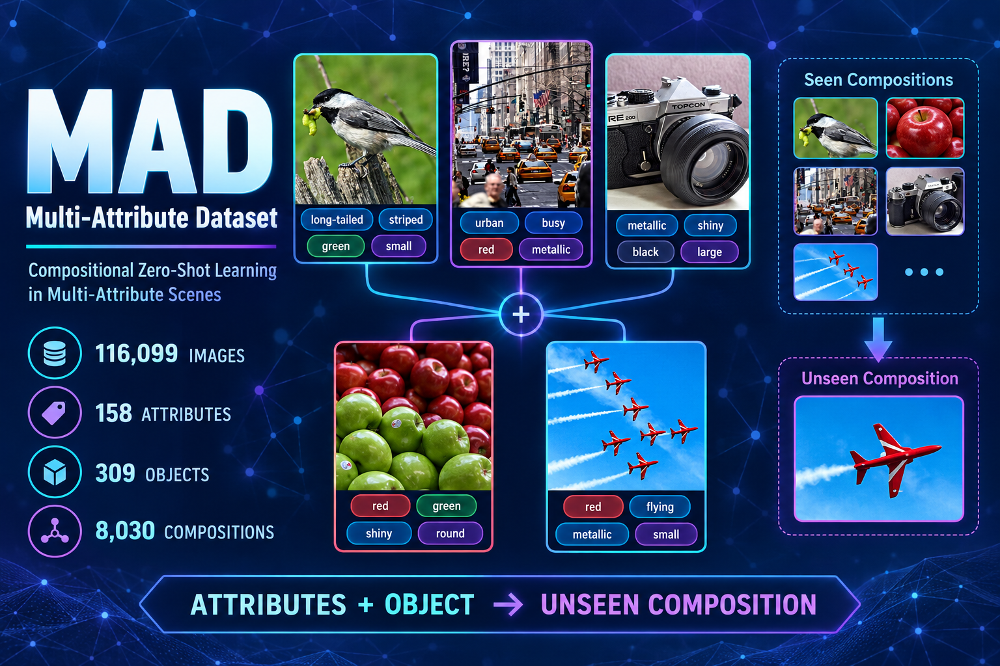

  

# Multi-Attribute Dataset (MAD)

MAD is a large-scale dataset for compositional zero-shot learning in multi-attribute scenes. It contains **116,099 images**, **158 attributes**, **309 object categories**, and **8,030 attribute-object compositions**. Each image is annotated with one to eight salient attributes.

## Dataset access

The complete dataset is hosted on Hugging Face:

**[IAIRCognitiveComputingGroup/Multi-Attribute-Dataset](https://huggingface.co/datasets/IAIRCognitiveComputingGroup/Multi-Attribute-Dataset)**

See [DATASET/README.md](DATASET/README.md) for download commands, extraction instructions, release structure, and licensing information.

## Evaluation metric

[`utils.py`](utils.py) provides the MAD authors' implementation of the proposed hard and soft multi-attribute evaluation metrics.

## Citation

H. Chen, J. Jiang and N. Zheng, "Learning to Infer Unseen Single-/Multi-Attribute-Object Compositions With Graph Networks," *IEEE Transactions on Pattern Analysis and Machine Intelligence*. DOI: [10.1109/TPAMI.2023.3273712](https://doi.org/10.1109/TPAMI.2023.3273712).
